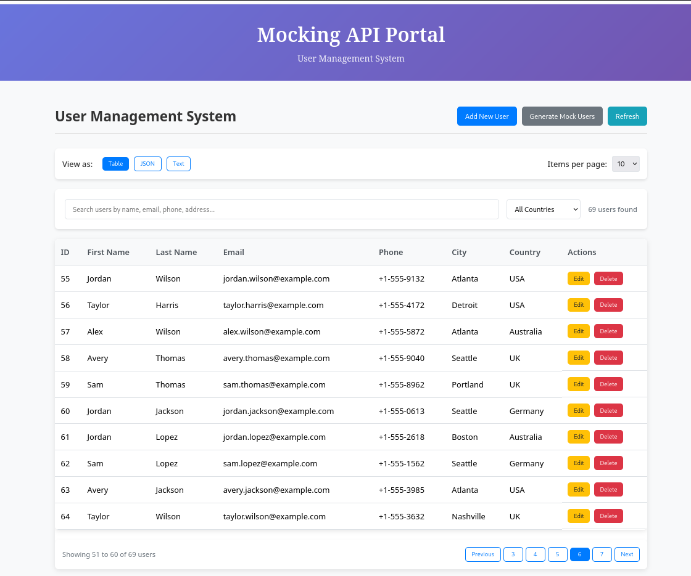

# 🚀 Mocking API Portal - User Management System

A modern, full-stack user management system built with **Angular 20** and **Spring Boot 3.5.6**. This project demonstrates CRUD operations, advanced search & filtering, pagination, and modern UI/UX patterns.


## 📸 Screenshots



## 🏗️ Architecture

```
├── Backend (Spring Boot)
│   ├── REST API Server (Port 8080)
│   ├── In-Memory Data Storage
│   ├── CORS Configuration
│   └── Mock Data Generation
│
└── Frontend (Angular 20)
    ├── Single Page Application (Port 4200)
    ├── Modern Angular Features (Signals, Control Flow)
    ├── Responsive UI/UX
    └── Real-time Toast Notifications
```

## 🌟 Current Features

### 🔧 Backend Features (Spring Boot)

#### **RESTful API Endpoints**
| Method | Endpoint | Description | Response |
|--------|----------|-------------|-----------|
| `GET` | `/api/users` | Get all users | `User[]` |
| `GET` | `/api/users/{id}` | Get user by ID | `User` |
| `POST` | `/api/users` | Create new user | `User` |
| `PUT` | `/api/users/{id}` | Update existing user | `User` |
| `DELETE` | `/api/users/{id}` | Delete user | `204 No Content` |
| `POST` | `/api/users/generate?count={n}` | Generate mock users | `User[]` |

#### **User Model Structure**
```json
{
  "id": 1,
  "firstName": "John",
  "lastName": "Doe", 
  "email": "john.doe@email.com",
  "phone": "+1-555-0123",
  "address": "123 Main St",
  "city": "New York",
  "country": "USA"
}
```

#### **Backend Technical Features**
- ✅ **In-Memory Storage**: Fast, lightweight data persistence
- ✅ **CORS Enabled**: Cross-origin requests from Angular frontend
- ✅ **Pre-loaded Data**: 5 sample users on startup
- ✅ **Smart User Generation**: Realistic mock data with randomized names, emails, addresses
- ✅ **Error Handling**: Proper HTTP status codes and error responses
- ✅ **Lombok Integration**: Clean, boilerplate-free code
- ✅ **Spring Web**: Modern Spring Boot 3.5.6 features

### 🎨 Frontend Features (Angular 20)

#### **Core User Management**
- ✅ **Complete CRUD Operations**: Create, Read, Update, Delete users
- ✅ **Modal Forms**: Professional popup forms for user creation/editing
- ✅ **Form Validation**: Required field validation with visual feedback
- ✅ **Confirmation Dialogs**: Safety confirmation for delete operations

#### **Advanced Search & Filtering** 🔍
- ✅ **Global Search**: Search across all user fields (name, email, phone, address, city, country)
- ✅ **Country Filter**: Dropdown filter by specific countries
- ✅ **Real-time Results**: Instant filtering as you type
- ✅ **Results Counter**: Shows "X users found (filtered)" with visual feedback
- ✅ **Clear Filters**: One-click button to reset all search criteria

#### **Smart Pagination** 📄
- ✅ **Flexible Page Sizes**: Choose 5, 10, 25, or 50 items per page
- ✅ **Intelligent Controls**: Previous/Next buttons with smart page numbering
- ✅ **Page Information**: "Showing X to Y of Z users" display
- ✅ **Search Integration**: Pagination works seamlessly with filtered results

#### **Multiple View Modes** 👁️
- ✅ **Table View**: Clean, sortable data table (default)
- ✅ **JSON View**: Pretty-formatted JSON with dark syntax highlighting
- ✅ **Text View**: Human-readable plain text format
- ✅ **Copy to Clipboard**: One-click copy functionality for JSON/Text data

#### **Toast Notification System** 📢
- ✅ **Success Notifications**: Green toasts for successful operations
- ✅ **Error Notifications**: Red toasts for failed operations
- ✅ **Auto-dismiss**: Notifications automatically disappear (4-6 seconds)
- ✅ **Manual Close**: Click × to dismiss immediately
- ✅ **Professional Styling**: Modern, animated notifications with icons
- ✅ **Responsive Design**: Perfect on mobile devices

#### **Modern Angular 20 Features**
- ✅ **Signal-based State**: Reactive state management with Angular Signals
- ✅ **Modern Control Flow**: Uses `@if`, `@for` blocks (not deprecated `*ngIf`/`*ngFor`)
- ✅ **Standalone Components**: No NgModule dependencies
- ✅ **Memory Leak Prevention**: Proper subscription cleanup with `takeUntil()`
- ✅ **HTTP with Fetch**: Optimized HTTP client configuration
- ✅ **TypeScript 5.9**: Latest TypeScript features and type safety

#### **User Experience (UX)**
- ✅ **Responsive Design**: Works perfectly on desktop, tablet, and mobile
- ✅ **Loading States**: Spinners and loading indicators during API calls
- ✅ **Professional UI**: Modern design with gradients, shadows, and animations
- ✅ **Accessibility**: Keyboard navigation and screen reader friendly
- ✅ **Error Handling**: Graceful error handling with user-friendly messages

## 🚀 Getting Started

### Prerequisites
- **Node.js** 18+ and npm
- **Java JDK** 17+
- **Angular CLI** 20+

### Backend Setup (Spring Boot)
```bash
cd simple_mocking_api
./gradlew bootRun
```
Backend will run on: http://localhost:8080

### Frontend Setup (Angular)
```bash
cd mocking-api-portal
npm install
npm start
```
Frontend will run on: http://localhost:4200

### Quick Start
1. Clone the repository
2. Start the backend server (port 8080)
3. Start the frontend server (port 4200)
4. Open http://localhost:4200 in your browser
5. Start managing users!

## 📱 Usage Examples

### Basic Operations
1. **View Users**: See all users in a clean table format
2. **Search Users**: Type in the search box to find specific users
3. **Filter by Country**: Use the dropdown to filter by country
4. **Add New User**: Click "Add New User" and fill out the form
5. **Edit User**: Click "Edit" button next to any user
6. **Delete User**: Click "Delete" button (with confirmation)
7. **Generate Mock Data**: Click "Generate Mock Users" for bulk data

### Advanced Features
- **Change View**: Switch between Table, JSON, and Text views
- **Adjust Page Size**: Select 5, 10, 25, or 50 items per page
- **Copy Data**: Export current page data as JSON or Text
- **Real-time Search**: Search results update as you type

## 🛠️ Technical Stack

### Backend
- **Framework**: Spring Boot 3.5.6
- **Language**: Java 17
- **Build Tool**: Gradle
- **Dependencies**: Spring Web, Lombok, H2 Database
- **Architecture**: RESTful API, Service Layer Pattern

### Frontend
- **Framework**: Angular 20.3.0
- **Language**: TypeScript 5.9.2
- **Styling**: Modern CSS with Flexbox/Grid
- **State Management**: Angular Signals
- **HTTP Client**: Angular HttpClient with Fetch API
- **Build Tool**: Angular CLI with Vite

## 🔮 Upcoming Features

### 🎯 **Phase 1: Enhanced Analytics**
- 📈 **User Statistics Dashboard**
  - User count by country pie chart
  - Registration trends over time
  - User demographics breakdown
  - Data visualization with Chart.js

### 🎯 **Phase 2: Bulk Operations**
- 📋 **Multi-Select Functionality**
  - Checkbox selection for multiple users
  - Bulk delete operations
  - Bulk export selected users
  - Select all/none functionality

### 🎯 **Phase 3: Data Import/Export**
- 📁 **CSV Operations**
  - Export all users to CSV file
  - Import users from CSV file
  - CSV template download
  - Data validation on import
  - Progress indicators for large imports

### 🎯 **Phase 4: Enhanced UX**
- ✅ **Advanced Form Validation**
  - Email format validation with regex
  - Phone number formatting and validation
  - Real-time validation feedback
  - Custom validation messages
  
- 🌙 **Dark Mode Theme**
  - Toggle between light/dark themes
  - Persistent user preference in localStorage
  - Smooth theme transition animations
  
- 🔄 **Auto-Refresh**
  - Optional auto-refresh every X seconds
  - Real-time data synchronization
  - Background refresh indicators

### 🎯 **Phase 5: Advanced Features**
- 🔐 **Authentication & Authorization**
  - JWT-based authentication
  - Role-based access control
  - User sessions and security
  
- 🗄️ **Database Integration**
  - Replace in-memory storage with PostgreSQL/MySQL
  - Data persistence across restarts
  - Database migrations with Flyway
  
- 📧 **Email Integration**
  - Send welcome emails to new users
  - Email templates with Thymeleaf
  - SMTP configuration

### 🎯 **Phase 6: DevOps & Production**
- 🐳 **Docker Containerization**
  - Docker containers for both frontend and backend
  - Docker Compose for easy deployment
  - Multi-stage builds for optimization
  
- ☁️ **Cloud Deployment**
  - AWS/GCP deployment configurations
  - CI/CD pipelines with GitHub Actions
  - Environment-specific configurations

## 🧪 Testing Strategy

### Current Testing
- ✅ Manual testing for all CRUD operations
- ✅ Cross-browser compatibility testing
- ✅ Responsive design testing

### Planned Testing
- 🔄 **Unit Tests**: JUnit for backend, Jasmine/Karma for frontend
- 🔄 **Integration Tests**: Full API endpoint testing
- 🔄 **E2E Tests**: Cypress for complete user journey testing
- 🔄 **Performance Tests**: Load testing with high user volumes

## 🤝 Contributing

1. Fork the repository
2. Create a feature branch (`git checkout -b feature/amazing-feature`)
3. Commit your changes (`git commit -m 'Add amazing feature'`)
4. Push to the branch (`git push origin feature/amazing-feature`)
5. Open a Pull Request

## 📄 License

This project is licensed under the MIT License - see the [LICENSE](LICENSE) file for details.

## 👨‍💻 Author

**Raksmey Koung**
- GitHub: [@cozysnipppetrkamsmey](https://github.com/cozysnippetraksmey)
- Email: raksmeykoung@gmail.com

## 🙏 Acknowledgments

- Angular team for the amazing framework
- Spring Boot team for the excellent backend framework
- All contributors and open-source libraries used

## 📞 Support

If you have any questions or issues, please:
1. Check the [Issues](https://github.com/your-repo/issues) page
2. Create a new issue with detailed description
3. Contact the author directly

---

⭐ **Star this repository if you find it useful!** ⭐
